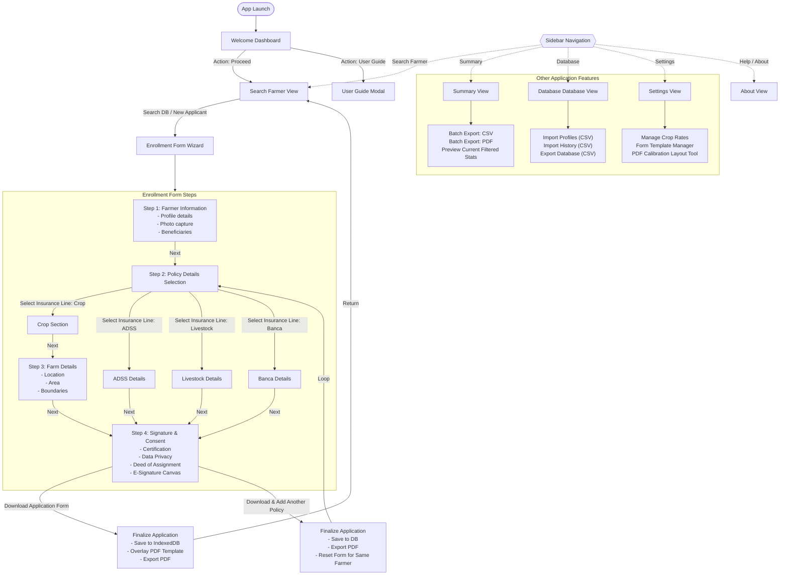

# PCIC RO10 Digital Insurance Application - Workflow Diagram

This document contains the complete workflow diagram of the application form based on `index.html` and the system's architecture.

## System Workflow Diagram

### Key Workflow Details:

1. **Routing and Navigation:**
   - The application acts as a Single Page Application (SPA). Switching tabs from the sidebar toggles the visibility of different core features (`view-welcome`, `view-enrollment`, `view-summary`, `view-database`, `view-settings`, `view-about`).

2. **The Enrollment Wizard:**
   - Driven under the `view-enrollment` container, it begins with searching for an existing farmer record from the local database or starting a blank application.
   - **Dynamic Routing:** Once in the "Policy Details Selection" step, the user must choose between **Crop**, **ADSS**, **Livestock**, or **Banca**. If **Crop** is selected, a specific **Step 3: Farm Details** prompts for location and area info. Conversely, ADSS, Livestock, and Banca bypass the farm details and proceed directly to **Step 4: Signature & Consent**.

3. **Finalization:**
   - Captures Farmer (and Guardian, if applicable) electronic signatures.
   - `jspdf` generates an offline PDF by drawing the captured input values onto an embedded or custom-uploaded form template.
   - Data is committed to the local `dexie.js` Database for offline storage.
